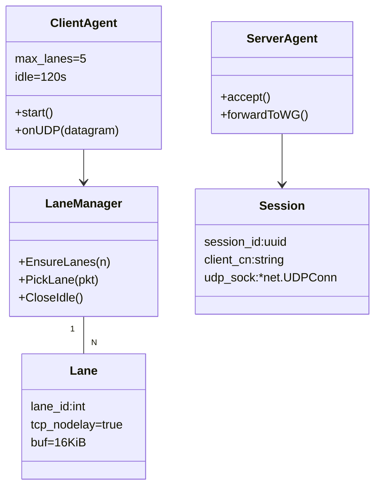
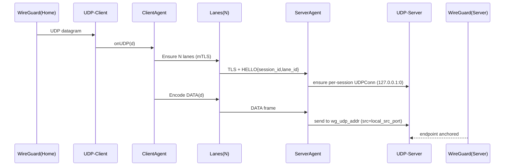
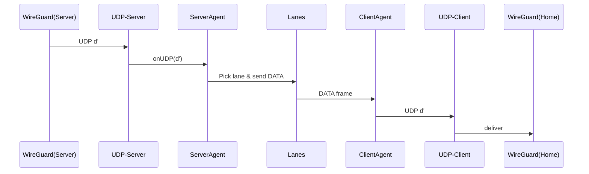

# AGENTS.md

## Overview
**Problem:** Home office 网络对 UDP 严格限制，导致 WireGuard（UDP）穿透效果差；需要隐藏流量类型并避免运营商识别。  
**Goal:** 使用 **TCP + TLS (mTLS)** 承载 UDP 报文（来自本地 WireGuard，未来可用 TUN），支持 **多 TCP 并行 lanes** 的“按报文粒度分流”，在 **空闲 120s** 自动关闭连接，有流量时自动重建；提供 **Prometheus** 指标。  
**Value:** 在 UDP 受限环境下维持可用、可观测的站点到云端（Home ↔ EC2）连接，主要承载 HTTP 流量（高带宽、中等延迟、可容抖动），并通过 **mTLS** 隐藏数据包类型与保护内容。

---

## Glossary, Constraints & Assumptions
**Glossary**
- **Lane**：一条 TCP+TLS 连接，用于承载帧化后的 UDP 报文。
- **Session**：一次 Client↔Server 的逻辑会话，由 `client_cn + session_id` 标识，聚合多条 lanes。
- **UDP Adapter**：与本机 WireGuard（或未来 TUN）的 UDP 接口层。
- **Framer/Deframer**：UDP 报文到传输帧（PDU）的编解码。

**Constraints**
- 语言：**Go**；平台：**macOS / arm64 Linux**；起步 **IPv4**。
- Server 默认端口 **5443**（可配）；Prometheus **:5080/metrics**（可配）。
- mTLS：**自签名**；以**证书 CN** 区分客户端（统计/会话）。
- Lanes：**固定上限**（默认 5），`TCP_NODELAY=true`，TCP 缓冲 **16KiB**（可配）。
- 空闲 **120s** 自动关闭，无心跳；首包触发建链，后续有流量自动重建。
- UDP 报文 **最大 64KiB**，超过直接丢弃并日志记录（不可配）。
- 背压：**drop oldest**；会话级队列上限默认 **4096 包 / 8MiB**（可配）。
- 不需要审计、限流、保活（心跳）；TLS 使用 Go 默认安全配置（优先 TLS1.3，允许 1.2）。

**Assumptions（置信度）**
- 按报文粒度分流即可满足 **100Mbps 单向**（0.8）。
- WG 端点通过本机 UDP 源端口锚定可稳定工作（0.8）。
- 多客户端未来以 mTLS CN 区分、共享监听端口（0.9）。

**Non-goals**
- 不提供多租户 ACL/配额；不提供限流、审计；不提供热更新证书（需重启）。

---

## User Stories & Acceptance Criteria

### US-01 配置与启动
- **Given** YAML（监听/目标/证书/metrics/队列等）
- **When** 作为 client/server 启动二进制或 Docker
- **Then** JSON 启动日志（含版本/配置摘要），进程运行正常

### US-02 mTLS 验证
- **Given** 双端加载私有 CA、正确证书
- **When** Client 连接 Server
- **Then** 握手成功；证书不合法/过期时拒绝并记录原因

### US-03 UDP 透明转发
- **Given** Client 监听本地 UDP（供 WG 指向），Server 连接本机 WG（127.0.0.1:51820）
- **When** 发送任意 UDP（≤64KiB）
- **Then** 另一端收到一致负载（往返方向同理）

### US-04 多 lane 分流（默认 5）
- **Given** N=5，`TCP_NODELAY` 开，缓冲 16KiB
- **When** 持续有 UDP 报文
- **Then** 报文整体分配到某一 lane，不跨 lane 切片

### US-05 空闲关闭与自动重连
- **Given** 已建立 lanes
- **When** 120s 无负载
- **Then** 关闭连接；有新流量时自动重建至上限

### US-06 Prometheus 指标
- **Given** `:5080/metrics`
- **When** 采集
- **Then** 暴露连接数、字节/包 in/out、丢弃、队列长度、TLS 握手时延、重连次数等

### US-07 性能目标
- **Given** 1 核 / 512Mi
- **When** 10 并发，单向 100Mbps
- **Then** 进程内额外处理延迟 P95 ≤ 10ms，资源不超预算

### US-08 背压策略
- **Given** 出口阻塞导致队列满
- **When** 新 UDP 到来
- **Then** 丢弃**最旧**报文并计数、告警日志（去抖）

### US-09 Docker 运行
- **Given** 镜像、配置、证书挂载
- **When** 启动容器
- **Then** 端口/metrics 正常

### US-10（未来）WSS 模式
- **Given** 切换传输为 WebSocket over TLS
- **Then** 维持相同 PDU 与分流模型

---

## Architecture Overview
- Client 在 Home（NAT 后）作为发起端；Server 在 EC2（公网域名，TCP :5443）。
- Client 从本地 WG 接收 UDP，封装为 PDU，通过 **N 条** TLS lanes 发往 Server。
- Server 为每个 `client_cn + session_id` 维护会话与本机 UDP socket（固定源端口）对接 WG；回程同理。
- 无心跳，空闲 120s 断开；新流量触发重建。



---

## Entities & Relationships

| 实体/服务 | 职责 | 关键字段 | 交互 |
|---|---|---|---|
| ClientAgent | UDP→PDU→多 lane 发送，下行写回本地 UDP | lanes, idle | WireGuard(Home), LaneManager |
| ServerAgent | 接入 lanes，聚合为会话，转发至本机 WG | sessionMap, wgAddr | WireGuard(Server), Session |
| Session | 标识一次会话 | `client_cn`, `session_id`, `udpConn` | 多条 Lane |
| Lane | 单条 TCP+TLS 连接 | `lane_id`, `conn` | Framer/Deframer |
| Framer | UDP ↔ PDU 编解码 | PDU v1 | Lane |
| UDPAdapter | 本机 UDP 接入 | `listenAddr` / `wgAddr` | WG |
| Metrics | Prometheus 暴露 | `:5080/metrics` | 采集端 |

**PDU v1**（大端）：`"UT"(2) | Ver(1)=0x01 | Type(1)=DATA/CTRL | Flags(1) | Len(4) | Payload(n≤65535)`。

---

## Key Flows

### 首包建链与上行


### 下行回程


---

## Module Design

| 模块 | 责任边界 | API（概要） | 依赖 | 持久化/缓存 | 错误/重试 | 观测 |
|---|---|---|---|---|---|---|
| Config | 加载/校验 YAML | `Load, Validate` | FS | 无 | 缺失/冲突报错退出 | 启动摘要 |
| TLSFactory | 构建 mTLS | `NewTLS(mode)` | crypto/tls | 无 | 加载失败即退出 | 握手参数 |
| Transport-TCP | Dial/Accept TCP+TLS | `DialLane, AcceptLoop` | net, tls | 无 | 指数退避/短退避 | 握手耗时 |
| LaneManager | Lanes 生命周期和选择 | `Ensure, PickLane, CloseIdle` | Transport | 内存 | 自动重连；空闲关闭 | lanes 活跃数 |
| Lane | 读写循环（帧） | `WriteFrame, ReadLoop` | Framer | 缓冲池 | I/O 失败关闭重建 | per-lane（可关） |
| Framer/Deframer | PDU 编解码 | `Encode, Decode` | - | sync.Pool | 超长/错误关闭 | frame_err |
| ControlPlane | HELLO/GOODBYE/ERR | `HandleHELLO` | Framer | - | 协议错误断开 | sessions |
| SessionManager | 会话映射与 UDPConn | `GetOrCreate, CloseIdle` | UDPAdapter | 内存 | UDP 写失败重试1次 | sessions |
| UDPAdapter(Client) | 本地 UDP 收/发 | `Start, WriteTo` | net.UDP | - | - | udp in/out |
| UDPAdapter(Server) | 本机 WG 交互 | `BindSession, ReadLoop` | net.UDP | - | - | udp in/out |
| Queue | 会话级环形队列 | `Push, Pop` | - | 内存 | 满则 drop-oldest | 队列长度 |
| Metrics | Prom 导出 | `Serve, Inc/Observe...` | promhttp | - | - | 全局指标 |
| Logging | JSON 日志 | `Info/Debug/Error` | slog | - | - | 结构化键 |

**队列阈值**：`max_packets=4096` 与 `max_bytes=8MiB` 任一达上限时触发丢弃；丢弃时递增 `ut_udp_drop_total{reason="oldest"}`。

---

## Data Model
> 仅进程内结构；无外部 DB。

- **Session Map**：Key=`client_cn + session_id` → `{udpConn, lanes[], queue, lastActive, stats}`
- **Lane Map**：Key=`lane_id` → `{conn, lastActive, writeCh}`
- **Queue**（环形）：`[][]byte` + `head/tail/count/curBytes`

---

## Test Plan

### Unit
- **Framer**：正常/边界（0、64KiB）、超长（>64KiB 报错）、黏包切分、截断与位翻转。
- **Queue**：FIFO；阈值达上限触发 drop-oldest；按字节与按包均生效；并发约束。
- **LaneManager**：RR 均衡、故障剔除与恢复；空闲 120s 关闭。
- **TLSFactory**：加载 CA/证书/私钥；非法证书失败。
- **UDPAdapter**：本地收发、异常路径。

### Integration
- **Client↔Server 转发**：UDP→N lanes→Server→WG（测试 UDP socket 模拟）；回程一致性。
- **背压**：Server 放慢读取，触发 Client 队列满，验证 drop-oldest 与指标。
- **mTLS**：合法/非法证书握手；CN 标记到指标（开关开启）。
- **空闲关闭 & 重连**：120s 静默后新流量触发重建。
- **多 lane 并发**：N=5，小报文高并发，负载大致均匀。

### E2E（可选）
- 两台主机装 WG，Peer 指向本地 UDP；启动 client/server；使用 HTTP 通过 WG 验证吞吐与稳定性。

### Acceptance（映射 US-01~US-09）
- 逐条自动化（Gherkin/Gomega）验证。

---

## Target-Language Interface Definitions (Go)

### 包布局
```
ut/
├─ cmd/uot/main.go
├─ cmd/udpmon/*.go
├─ internal/config/config.go
├─ internal/tlsutil/tls.go
├─ internal/proto/{pdu.go,control.go}
├─ internal/transport/tcp.go
├─ internal/lane/{lane.go,manager.go}
├─ internal/queue/ring.go
├─ internal/udp/{adapter_client.go,adapter_server.go}
├─ internal/server/server.go
├─ internal/client/client.go
├─ internal/metrics/metrics.go
├─ internal/logging/logging.go
└─ pkg/version/version.go
```

### 关键常量/错误（proto）
```go
const (
  MagicHi='U'; MagicLo='T'; Version=0x01
  TypeData=0x01; TypeCtrl=0x10
  MaxUDPPayload=65535 // 超过丢弃并记录
)
var (
  ErrBadMagic=errors.New("bad magic")
  ErrBadVersion=errors.New("bad version")
  ErrTooLarge=errors.New("payload too large")
  ErrShortFrame=errors.New("short frame")
)
```

### 传输与 Lane 接口
```go
type LaneConn interface {
  net.Conn
  LaneID() int
  PeerCN() string // 从 tls.ConnectionState 提取
}

type Dialer interface {
  DialLane(ctx context.Context, laneID int) (LaneConn, error)
  Close() error
}

type Acceptor interface {
  AcceptLoop(ctx context.Context, onAccept func(LaneConn)) error
  Close() error
}
```

### Lane 管理
```go
type PickerStrategy int
const ( PickRoundRobin PickerStrategy = iota; PickHash )

type Manager struct {
  // Ensure(ctx, n), PickLane(pkt), CloseIdle()
}
```

### Session/Server
```go
type Session struct {
  ClientCN, SessionID string
  UDPConn *net.UDPConn
  // lanes, queue, stats...
}

func RunServer(ctx context.Context, cfg config.Config) error
func RunClient(ctx context.Context, cfg config.Config) error
```

### 配置（YAML）
```yaml
role: client # or server
tcp:
  server_addr: "ec2.example.com:5443" # client
  listen_addr: "0.0.0.0:5443"         # server
  lanes: 5
  tcp_nodelay: true
  tcp_buf: 16384
  idle_seconds: 120
udp:
  listen_addr: "127.0.0.1:15000"      # client
  wg_udp_addr: "127.0.0.1:51820"      # server
queue:
  max_packets: 4096
  max_bytes: 8388608
  drop_policy: "oldest"
metrics:
  listen_addr: "127.0.0.1:5080"
  path: "/metrics"
  per_client_cn: true
tls:
  ca_cert: "/etc/ut/ca.pem"
  cert: "/etc/ut/node.pem"
  key: "/etc/ut/node.key"
```

### 并发/时序约定
- 每 lane：独立读/写 goroutine；`Read/WriteDeadline`=120s。  
- `EnsureLanes(N)` 首包触发拨号；拨号失败指数退避（5→60s）。  
- 队列为会话级；满则 drop-oldest。  
- 不跨 lane 分片；RR 选择（可选 hash）。

### 错误类型/日志键
- 错误键：`event`, `err`, `client_cn`, `session_id`, `lane_id`。  
- 重要事件：`tls_handshake_fail`, `lane_open`, `lane_close`, `queue_drop_oldest`, `pdu_too_large`.

###（可选）Dockerfile
```dockerfile
FROM golang:1.22 AS build
WORKDIR /src
COPY . .
RUN CGO_ENABLED=0 go build -ldflags "-s -w" -o /out/ut ./cmd/uot

FROM gcr.io/distroless/base-debian12
COPY --from=build /out/ut /usr/local/bin/ut
ENTRYPOINT ["/usr/local/bin/ut","-config","/etc/ut/ut.yaml"]
```

---

## Iteration Plan & Build Order

**M0 骨架**  
- 包结构、配置加载、TLS、metrics、日志、cmd 入口

**M1 基线转发**  
- PDU 编解码、单 lane 转发（Client↔Server↔WG）、空闲关闭

**M2 多 lane**  
- LaneManager（RR）、会话聚合、会话级队列、背压 drop-oldest

**M3 稳定性与观测**  
- 指标完善、错误处理/退避、资源优化（池化/零拷贝）、压测达 100Mbps

**M4 扩展（可选）**  
- 传输抽象，新增 **WebSocket over TLS** 实现；per-lane 指标开关；IPv6

**Deliverables**：二进制 + Docker 镜像 + 示例 YAML + 指标文档 + 使用指南。

---

## Operability

**Logging**  
- JSON；默认 `info`；可 `debug`。不记录载荷内容。关键字段：`event, role, client_cn, session_id, lane_id`.

**Metrics（Prometheus）**  
- `ut_sessions_active` (gauge)  
- `ut_lanes_active_total` (gauge)  
- `ut_udp_in_bytes_total{dir=up|down}` / `...packets_total`  
- `ut_udp_out_bytes_total{dir=up|down}` / `...packets_total`  
- `ut_udp_drop_total{reason="oldest"}`  
- `ut_tls_handshake_seconds` (histogram)  
- `ut_lane_reconnect_total` (counter)  
- `ut_queue_len` (gauge)  
- 标签：默认含 `client_cn`（可关）；`lane_id`（默认关）。

**Alert（示例）**
- `rate(ut_udp_drop_total[5m]) > 0`：背压丢弃告警  
- `ut_sessions_active == 0` 且有输入流量：链路中断  
- `histogram_quantile(0.95, sum(rate(ut_tls_handshake_seconds_bucket[5m])) by (le)) > 2`：握手异常慢

**Runtime Args**  
- `-config /path/ut.yaml`；其余通过 YAML 配置。

---

## Security & Compliance

- **mTLS 强制**：Server 端 `tls.RequireAndVerifyClientCert`；Client 端验证 Server 证书链。  
- **身份标识**：以**证书 CN** 标记客户端（会话/指标）。  
- **TLS 版本**：Go 默认（优先 1.3，允许 1.2）；套件使用安全默认。  
- **证书轮换**：重启生效（无热更新）。  
- **数据保护**：仅 TLS 传输层加密；不做应用层再加密（未来 TUN 可替代 WG）。  
- **隐匿性**：SNI/ALPN 使用 Go 默认行为，表现为常规 TLS 流量。

---

## Risks & Mitigations / Open Questions

**Risks**
- 高 BDP 场景吞吐不足 → 提供可调 `lanes` / `tcp_buf`，并在文档给建议值  
- 标签基数爆炸（按 CN） → 默认关闭细粒度；白名单  
- 首包并发拨号成本高 → 允许预热 lanes（可选）  
- UDP > 64KiB 输入 → 硬拒并计数，避免 OOM

**Open Questions / TODO**
- TODO: 是否需要 Hash 选择策略（按报文首部 bytes）开关默认值。  
- TODO: 未来 TUN 模式的 IP 层封装与 MTU 策略。  
- TODO: WSS 模式具体握手细节（路径、子协议）。  
- TODO: IPv6 支持与测试矩阵。  

---

## Changelog
- **v0.1.0（本文件）**：确定需求与架构；PDU v1；Go 接口与骨架；默认端口 5443/5080；UDP 最大 64KiB；多 lane（默认 5）；drop-oldest 背压；空闲 120s 关闭；mTLS+CN 标识。
